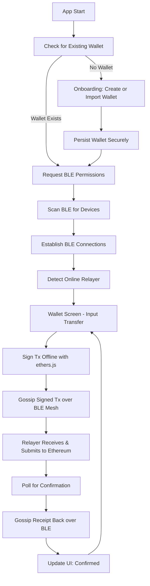

# BLETxns App Architecture

## Overview

The BLETxns app is a React Native application targeting both iOS and Android platforms. It enables offline ERC-20 token transfers on Ethereum via a Bluetooth Low Energy (BLE) mesh network. In a group of up to 100+ devices (e.g., 10 people, 9 offline), users can initiate token transfers between offline devices. The transaction is signed locally, propagated through the BLE mesh using gossip routing, relayed by the single online device to the blockchain, and acknowledgments are sent back through the mesh to sender and receiver.

Key goals:

- On first app launch, guide user through wallet creation or import, persisting securely for future use.
- Discover and connect devices via BLE for low-energy mesh formation.
- Sign ERC-20 transfers offline using local wallets with ethers.js.
- Propagate signed transactions via BLE gossip to the auto-selected online relayer.
- Submit transactions to Ethereum and return confirmations via BLE mesh.
- Ensure security with encrypted propagation and key management.
- Minimize battery impact by optimizing BLE usage for discovery, connections, and data transfer.

## High-Level Components

### 1. Mesh Networking Layer (BLE-Only)

- **Device Discovery**: BLE scanning (`react-native-ble-plx`) to find nearby devices advertising a custom UUID. Track online/offline status (e.g., via periodic beacons reporting internet connectivity).
- **Connection Handling**: Establish BLE GATT connections to 5-15 direct peers per device based on RSSI and density. Implement multi-hop mesh topology using BLE for forwarding.
- **Propagation**: Gossip protocol for transaction dissemination over BLE: forward signed tx to random subset of peers (fanout 3-5) with TTL=20 using GATT write/notify characteristics. Relayer detection: Auto-select the first device reporting online status; fallback to election if multiple.
- **Relayer Logic**: Online device receives tx via BLE GATT, submits to Ethereum RPC using ethers.js, monitors confirmation (e.g., wait for 1 block), then gossips acknowledgment back to mesh with tx hash/receipt via BLE.

### 2. Blockchain Integration Layer

- **Wallet Management**: On first launch, check for existing wallet in secure storage (react-native-keychain). If none, prompt user to create new wallet (generate mnemonic/private key with ethers.js) or import via mnemonic/seed. Persist private key and address securely; use biometric authentication for access. Local private keys stored securely (e.g., react-native-keychain). Use ethers.js for offline signing of ERC-20 transfers (`transfer` method calls).
- **Transaction Signing**: Sender creates unsigned tx with recipient address, amount, token contract; signs locally without network. Propagate signed raw tx through BLE mesh.
- **Relayer Submission**: Online relayer uses ethers.js Provider to connect to Ethereum node (e.g., Infura/Alchemy RPC), broadcasts signed tx, waits for confirmation, propagates receipt via BLE.
- **Acknowledgment**: Receipt includes tx hash, block number, status; gossiped back via BLE to confirm delivery to sender/receiver.

### 3. Application Layer

- **State Management**: Redux for global state (devices, pending txs, wallet balances, mesh topology, wallet status).
- **Transaction Handling**: Queue pending txs locally; propagate on mesh join. Handle receipts to update UI and local logs.
- **Error Handling**: Retry propagation on failures; timeout for relayer response (e.g., 5 min); user notifications for stuck txs.
- **Onboarding**: At app start, if no wallet exists, navigate to onboarding screen for creation/import; skip if wallet present.

### 4. UI Layer

- **Navigation**: Initial onboarding flow, then tab navigator for Wallet (balances), Mesh (devices/online status), Transactions (history/pending).
- **Screens**:
  - **Onboarding**: Wallet creation (generate mnemonic, confirm) or import (enter mnemonic); biometric setup.
  - **Wallet**: Display ERC-20 balances (fetched when online or via relayer query), input for transfers (recipient, amount). Biometric unlock if required.
  - **Mesh**: List devices, online/offline indicators, connect/disconnect, relayer status.
  - **Transactions**: Pending/offline txs, confirmed receipts, resend options.
- **Styling**: React Native Paper for cross-platform UI.

## Data Models

### Transaction

```typescript
interface Transaction {
  id: string // UUID
  senderAddress: string // Ethereum address
  recipientAddress: string
  tokenContract: string // ERC-20 contract address
  amount: string // Wei or decimal
  signedTx: string // Signed raw transaction hex
  status: "pending" | "propagated" | "submitted" | "confirmed" | "failed"
  timestamp: number
  relayerId?: string // Device ID of relayer
  txHash?: string // On confirmation
}
```

### Device

```typescript
interface Device {
  id: string // BLE identifier
  name: string
  isOnline: boolean // Internet connectivity
  rssi: number
  connected: boolean
  role: "sender" | "receiver" | "relayer" | "peer"
  lastSeen: number
}
```

### Wallet

```typescript
interface Wallet {
  address: string // Ethereum address
  privateKey: string // Encrypted in storage
  mnemonic?: string // For backup/recovery
  createdAt: number
  isBiometricEnabled: boolean
}
```

### Mesh Topology

- Map: `{ deviceId: Device }`
- Updated via BLE beacons; track online relayers.

## Dependencies

- `react-native-ble-plx`: BLE discovery, connections, and GATT for mesh.
- `ethers`: Ethereum library for wallet generation, signing/submission.
- `@react-navigation/native`, `@react-navigation/bottom-tabs`: Navigation.
- `@reduxjs/toolkit`, `react-redux`: State.
- `@react-native-async-storage/async-storage`, `react-native-keychain`: Storage/keys.
- `uuid`, `crypto-js`: Utils/encryption.
- `bloom-filters`: Gossip deduplication.
- Platform: React Native CLI (bare for native modules).

## Platform-Specific Considerations

- **iOS**:
  - BLE: `NSBluetoothAlwaysUsageDescription` in Info.plist.
  - Keys: Secure Enclave via Keychain.
  - Background: Limited; use background tasks for BLE scanning and GATT.
- **Android**:
  - Permissions: BLE (`BLUETOOTH_SCAN`, `BLUETOOTH_CONNECT`, `ACCESS_FINE_LOCATION`), Internet.
  - Keys: Keystore for secure storage.
- Both: Runtime permissions; ethers.js works offline for signing/wallet ops, online for RPC. BLE GATT for all data transfer, including multi-hop via application-level routing.

## Security Considerations

- **Key Management**: Private keys never leave device; use biometric unlock for signing. Mnemonic shown once during creation for backup.
- **Encryption**: Encrypt tx payloads in BLE mesh with AES (ephemeral keys via DH exchange over GATT characteristics).
- **Relayer Trust**: Relayer submits as-is; no alteration possible due to signing. Verify receipts with tx hash.
- **Privacy**: Anonymize device IDs in mesh; optional wallet address obfuscation.
- **Risks**: BLE interception (mitigate with encryption); relayer failure (retry with next online); double-spend (Ethereum handles); secure mnemonic handling during import.

## Mesh Implementation Details

- **Relayer Selection**: Poll devices for online status via BLE beacons; auto-assign first online as relayer. If none, queue tx until one joins.
- **Tx Flow**:
  1. Sender signs ERC-20 transfer offline with ethers.js, creates tx object, gossips to mesh via BLE GATT.
  2. Peers forward via gossip (random fanout, TTL=20, bloom dedup) over BLE.
  3. Relayer receives via BLE, submits to Ethereum, waits for confirmation (poll RPC).
  4. Relayer gossips receipt back via BLE; sender/receiver update status on receipt.
- **Offline Handling**: All signing/propagation offline; only relayer needs internet.
- **Scaling**: Gossip ensures propagation in 100+ devices with low overhead; BLE for persistence and low energy.

## UI/UX Flow (Mermaid Diagram)



## BLE Limitations and Mitigations

- **Data Size Constraints**: BLE MTU typically 20-512 bytes; for larger signed tx (up to ~300 bytes), fragment payloads across multiple GATT writes or use longer MTU negotiation.
- **Battery Optimization**: Use BLE advertising for discovery only; limit connection intervals; disconnect idle peers; schedule gossip bursts.
- **Reconnection Logic**: Monitor BLE disconnections; auto-reconnect on proximity; queue ACKs for offline devices and deliver on reconnection.

## Setup Steps

1. `npx react-native init BLETxns`.
2. Install deps: `npm install ethers react-native-ble-plx @react-navigation/native @reduxjs/toolkit react-redux ...`.
3. Configure platforms: Permissions, link natives, pod install (iOS).
4. Custom UUIDs for BLE service/characteristics; RPC endpoint config (e.g., Infura).

## Testing Strategy

- **Unit**: Jest for signing (ethers.js mocks), wallet generation/import, gossip logic over BLE.
- **Integration**: Mock BLE manager, test propagation/receipt flow, onboarding persistence.
- **E2E**: Detox with emulators; simulate offline/online, 5-10 devices, first-launch onboarding.
- **Edge Cases**: No relayer, tx failure, key security, BLE disconnections, invalid mnemonic import.
- **Security**: Audit signing, encryption, wallet persistence; test relayer integrity.

## Deployment Notes

- **Build**: `npx react-native run-ios/android`; Fastlane for prod.
- **Stores**: Disclose crypto/wallet features; comply with financial regs (e.g., no fiat).
- **Distribution**: Ad-hoc testing; OTA via CodePush.

This BLE-only mesh architecture enables secure offline ERC-20 transfers with relayer acknowledgment, including initial wallet onboarding and persistence.
