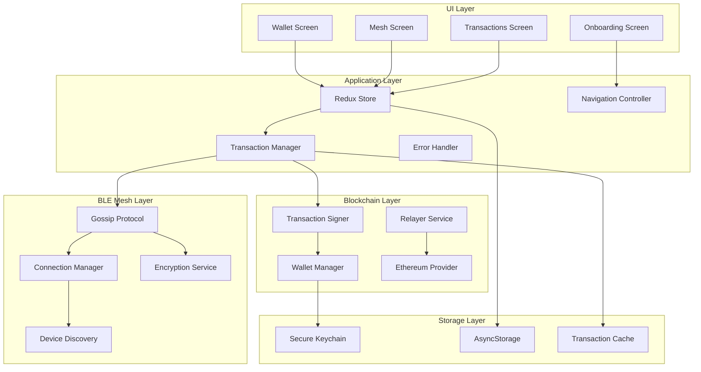
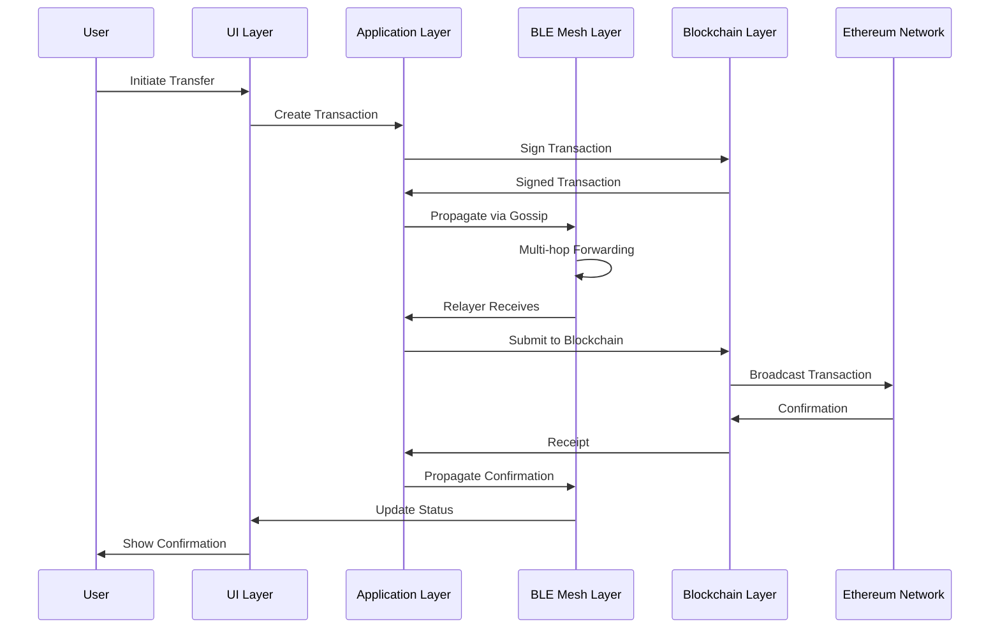

# Design Document

## Overview

The BLETxns application implements a decentralized mesh network using Bluetooth Low Energy (BLE) to enable offline ERC-20 token transfers. The system consists of four main layers: the BLE Mesh Networking Layer, Blockchain Integration Layer, Application State Management Layer, and User Interface Layer. The architecture follows a peer-to-peer gossip protocol for transaction propagation while maintaining security through local key management and encrypted communications.

## Architecture

### System Architecture Diagram



### Data Flow Architecture



## Components and Interfaces

### 1. BLE Mesh Networking Layer

#### Device Discovery Service
```typescript
interface DeviceDiscoveryService {
  startScanning(): Promise<void>
  stopScanning(): Promise<void>
  getDiscoveredDevices(): Device[]
  onDeviceFound: (callback: (device: Device) => void) => void
  onDeviceLost: (callback: (deviceId: string) => void) => void
}
```

#### Connection Manager
```typescript
interface ConnectionManager {
  connectToDevice(deviceId: string): Promise<boolean>
  disconnectFromDevice(deviceId: string): Promise<void>
  getConnectedDevices(): Device[]
  maintainOptimalConnections(): Promise<void>
  onConnectionStateChange: (callback: (deviceId: string, connected: boolean) => void) => void
}
```

#### Gossip Protocol Engine
```typescript
interface GossipProtocol {
  propagateTransaction(transaction: SignedTransaction): Promise<void>
  propagateAcknowledment(ack: TransactionAcknowledment): Promise<void>
  onTransactionReceived: (callback: (tx: SignedTransaction) => void) => void
  onAcknowledmentReceived: (callback: (ack: TransactionAcknowledment) => void) => void
  setFanoutFactor(factor: number): void
  setTTL(ttl: number): void
}
```

#### Encryption Service
```typescript
interface EncryptionService {
  generateEphemeralKeys(): Promise<KeyPair>
  performKeyExchange(deviceId: string, publicKey: string): Promise<string>
  encryptPayload(data: string, sharedSecret: string): Promise<string>
  decryptPayload(encryptedData: string, sharedSecret: string): Promise<string>
}
```

### 2. Blockchain Integration Layer

#### Wallet Manager
```typescript
interface WalletManager {
  createWallet(): Promise<Wallet>
  importWallet(mnemonic: string): Promise<Wallet>
  getWallet(): Promise<Wallet | null>
  requireBiometricAuth(): Promise<boolean>
  getBalance(tokenContract: string): Promise<string>
  validateAddress(address: string): boolean
}
```

#### Transaction Signer
```typescript
interface TransactionSigner {
  signERC20Transfer(
    recipientAddress: string,
    amount: string,
    tokenContract: string
  ): Promise<SignedTransaction>
  validateTransaction(tx: SignedTransaction): boolean
}
```

#### Relayer Service
```typescript
interface RelayerService {
  isOnline(): Promise<boolean>
  submitTransaction(signedTx: SignedTransaction): Promise<string>
  waitForConfirmation(txHash: string): Promise<TransactionReceipt>
  broadcastAcknowledment(ack: TransactionAcknowledment): Promise<void>
}
```

### 3. Application State Management Layer

#### Redux Store Structure
```typescript
interface AppState {
  wallet: WalletState
  mesh: MeshState
  transactions: TransactionState
  ui: UIState
}

interface WalletState {
  address: string | null
  isUnlocked: boolean
  balances: Record<string, string>
  biometricEnabled: boolean
}

interface MeshState {
  discoveredDevices: Device[]
  connectedDevices: Device[]
  onlineRelayers: string[]
  meshTopology: Record<string, string[]>
}

interface TransactionState {
  pending: Transaction[]
  confirmed: Transaction[]
  failed: Transaction[]
}
```

#### Transaction Manager
```typescript
interface TransactionManager {
  createTransaction(details: TransactionDetails): Promise<string>
  signAndPropagate(transactionId: string): Promise<void>
  handleIncomingTransaction(tx: SignedTransaction): Promise<void>
  handleAcknowledment(ack: TransactionAcknowledment): Promise<void>
  retryFailedTransaction(transactionId: string): Promise<void>
}
```

### 4. User Interface Layer

#### Navigation Structure
```typescript
interface NavigationStructure {
  OnboardingStack: {
    Welcome: undefined
    CreateWallet: undefined
    ImportWallet: undefined
    BiometricSetup: undefined
  }
  MainTabs: {
    Wallet: undefined
    Mesh: undefined
    Transactions: undefined
  }
}
```

#### Screen Components
```typescript
interface WalletScreenProps {
  balance: string
  onTransfer: (details: TransferDetails) => void
  isLoading: boolean
}

interface MeshScreenProps {
  devices: Device[]
  onConnect: (deviceId: string) => void
  onDisconnect: (deviceId: string) => void
  relayerStatus: RelayerStatus
}

interface TransactionsScreenProps {
  transactions: Transaction[]
  onRetry: (transactionId: string) => void
  onRefresh: () => void
}
```

## Data Models

### Core Data Models

```typescript
interface Wallet {
  address: string
  privateKey: string // Encrypted in storage
  mnemonic?: string // For backup/recovery
  createdAt: number
  isBiometricEnabled: boolean
}

interface Device {
  id: string // BLE identifier
  name: string
  isOnline: boolean
  rssi: number
  connected: boolean
  role: DeviceRole
  lastSeen: number
  publicKey?: string // For encryption
}

type DeviceRole = "sender" | "receiver" | "relayer" | "peer"

interface Transaction {
  id: string // UUID
  senderAddress: string
  recipientAddress: string
  tokenContract: string
  amount: string
  signedTx: string
  status: TransactionStatus
  timestamp: number
  relayerId?: string
  txHash?: string
  blockNumber?: number
  gasUsed?: string
  confirmations: number
}

type TransactionStatus = "pending" | "propagated" | "submitted" | "confirmed" | "failed"

interface SignedTransaction {
  id: string
  rawTransaction: string
  senderAddress: string
  recipientAddress: string
  tokenContract: string
  amount: string
  nonce: number
  gasLimit: string
  gasPrice: string
  timestamp: number
  ttl: number
}

interface TransactionAcknowledment {
  transactionId: string
  txHash: string
  blockNumber: number
  status: "success" | "failed"
  gasUsed: string
  timestamp: number
  relayerId: string
}

interface BLEMessage {
  type: "transaction" | "acknowledgment" | "beacon" | "keyExchange"
  payload: string // Encrypted
  senderId: string
  timestamp: number
  messageId: string
}
```

### Storage Models

```typescript
interface SecureStorage {
  privateKey: string
  mnemonic?: string
  biometricKey: string
}

interface LocalStorage {
  walletAddress: string
  deviceId: string
  knownDevices: Device[]
  transactionHistory: Transaction[]
  meshTopology: Record<string, string[]>
  appSettings: AppSettings
}

interface AppSettings {
  biometricEnabled: boolean
  autoRelayEnabled: boolean
  maxConnections: number
  gossipFanout: number
  transactionTimeout: number
  rpcEndpoint: string
}
```

## Error Handling

### Error Categories and Handling Strategies

#### BLE Connection Errors
```typescript
interface BLEErrorHandler {
  handleConnectionTimeout(deviceId: string): Promise<void>
  handlePermissionDenied(): Promise<void>
  handleBluetoothDisabled(): Promise<void>
  handleScanningFailed(): Promise<void>
}
```

**Strategy**: Implement exponential backoff for reconnection attempts, graceful degradation when BLE is unavailable, and clear user messaging for permission issues.

#### Blockchain Errors
```typescript
interface BlockchainErrorHandler {
  handleInsufficientFunds(): Promise<void>
  handleNetworkError(): Promise<void>
  handleTransactionFailed(reason: string): Promise<void>
  handleRelayerOffline(): Promise<void>
}
```

**Strategy**: Queue transactions for retry, provide alternative relayer selection, and maintain transaction state across app restarts.

#### Wallet Security Errors
```typescript
interface SecurityErrorHandler {
  handleBiometricFailed(): Promise<void>
  handleInvalidMnemonic(): Promise<void>
  handleKeyDecryptionFailed(): Promise<void>
  handleUnauthorizedAccess(): Promise<void>
}
```

**Strategy**: Implement secure fallback authentication methods, clear error messaging, and automatic security lockouts.

### Error Recovery Mechanisms

1. **Automatic Retry Logic**: Exponential backoff for network operations
2. **Graceful Degradation**: Reduced functionality when components fail
3. **State Persistence**: Maintain operation state across app crashes
4. **User Notification**: Clear, actionable error messages
5. **Fallback Options**: Alternative paths when primary methods fail

## Testing Strategy

### Unit Testing Approach

#### BLE Layer Testing
```typescript
describe('GossipProtocol', () => {
  it('should propagate transaction to correct number of peers')
  it('should respect TTL limits')
  it('should deduplicate received transactions')
  it('should handle encryption/decryption correctly')
})

describe('ConnectionManager', () => {
  it('should maintain optimal connection count')
  it('should handle connection failures gracefully')
  it('should prioritize connections by RSSI')
})
```

#### Blockchain Layer Testing
```typescript
describe('WalletManager', () => {
  it('should generate valid mnemonic phrases')
  it('should import wallets correctly')
  it('should secure private keys properly')
})

describe('TransactionSigner', () => {
  it('should sign ERC-20 transactions correctly')
  it('should validate transaction parameters')
  it('should handle signing errors')
})
```

### Integration Testing

#### End-to-End Transaction Flow
```typescript
describe('Transaction Flow', () => {
  it('should complete offline transaction with online relayer')
  it('should handle multiple simultaneous transactions')
  it('should recover from relayer failures')
  it('should maintain transaction integrity across mesh')
})
```

#### Mesh Network Testing
```typescript
describe('Mesh Network', () => {
  it('should form stable connections with multiple devices')
  it('should propagate messages across multi-hop network')
  it('should handle device disconnections gracefully')
  it('should select optimal relayers automatically')
})
```

### Security Testing

#### Cryptographic Testing
- Verify encryption/decryption integrity
- Test key exchange protocols
- Validate secure storage implementation
- Audit transaction signing process

#### Attack Vector Testing
- Test against BLE interception attempts
- Verify protection against replay attacks
- Test wallet security under various threat models
- Validate transaction integrity across mesh

### Performance Testing

#### Battery Usage Testing
- Measure BLE scanning power consumption
- Test connection maintenance efficiency
- Validate background operation impact
- Optimize gossip protocol overhead

#### Scalability Testing
- Test mesh performance with 100+ devices
- Measure transaction propagation latency
- Validate connection stability under load
- Test relayer selection efficiency

## Security Considerations

### Key Management Security

#### Private Key Protection
- **Storage**: Use hardware-backed secure storage (iOS Secure Enclave, Android Keystore)
- **Access**: Require biometric authentication for key usage
- **Transmission**: Never transmit private keys over any medium
- **Backup**: Display mnemonic only once during wallet creation

#### Encryption Key Management
```typescript
interface KeyManagement {
  generateEphemeralKeys(): Promise<KeyPair>
  rotateEncryptionKeys(): Promise<void>
  secureKeyExchange(deviceId: string): Promise<string>
  validateKeyIntegrity(): Promise<boolean>
}
```

### Network Security

#### BLE Communication Security
- **Encryption**: AES-256 encryption for all BLE payloads
- **Key Exchange**: Elliptic Curve Diffie-Hellman for session keys
- **Authentication**: Device identity verification through cryptographic challenges
- **Replay Protection**: Timestamp and nonce validation for all messages

#### Transaction Security
- **Integrity**: Cryptographic signatures prevent transaction tampering
- **Non-repudiation**: Blockchain immutability provides transaction proof
- **Double-spend Protection**: Ethereum network consensus prevents double-spending
- **Relayer Trust**: Relayers cannot modify signed transactions

### Privacy Protection

#### Data Minimization
- **Device Identity**: Use rotating BLE identifiers
- **Transaction Privacy**: Optional address obfuscation
- **Metadata Protection**: Minimize exposed transaction metadata
- **Mesh Anonymity**: Prevent correlation of device identity with wallet address

#### Information Leakage Prevention
- **Side-channel Protection**: Constant-time cryptographic operations
- **Memory Protection**: Secure memory clearing after key operations
- **Logging Security**: No sensitive data in application logs
- **Debug Protection**: Disable debug features in production builds

## Performance Optimization

### BLE Optimization Strategies

#### Connection Management
```typescript
interface BLEOptimization {
  optimizeConnectionIntervals(): void
  implementAdaptiveScanning(): void
  batchGATTOperations(): void
  manageConnectionPriority(): void
}
```

#### Power Management
- **Adaptive Scanning**: Reduce scan frequency when mesh is stable
- **Connection Pooling**: Reuse connections for multiple operations
- **Background Optimization**: Minimal BLE activity when app is backgrounded
- **Battery-aware Operations**: Reduce mesh participation on low battery

### Memory and Storage Optimization

#### Efficient Data Structures
- **Bloom Filters**: Memory-efficient transaction deduplication
- **LRU Caches**: Optimal device and transaction caching
- **Compressed Storage**: Efficient transaction history storage
- **Lazy Loading**: Load transaction details on demand

#### State Management Optimization
```typescript
interface StateOptimization {
  implementMemoization(): void
  optimizeReduxSelectors(): void
  batchStateUpdates(): void
  implementVirtualization(): void
}
```

### Network Performance

#### Gossip Protocol Optimization
- **Adaptive Fanout**: Adjust propagation based on mesh density
- **Smart Routing**: Prefer high-quality connections for forwarding
- **Congestion Control**: Throttle propagation during network congestion
- **Priority Queuing**: Prioritize acknowledgments over new transactions

#### Relayer Optimization
- **Load Balancing**: Distribute transactions across multiple relayers
- **Health Monitoring**: Track relayer performance and reliability
- **Failover Logic**: Quick switching to backup relayers
- **Batch Submission**: Group multiple transactions for efficiency